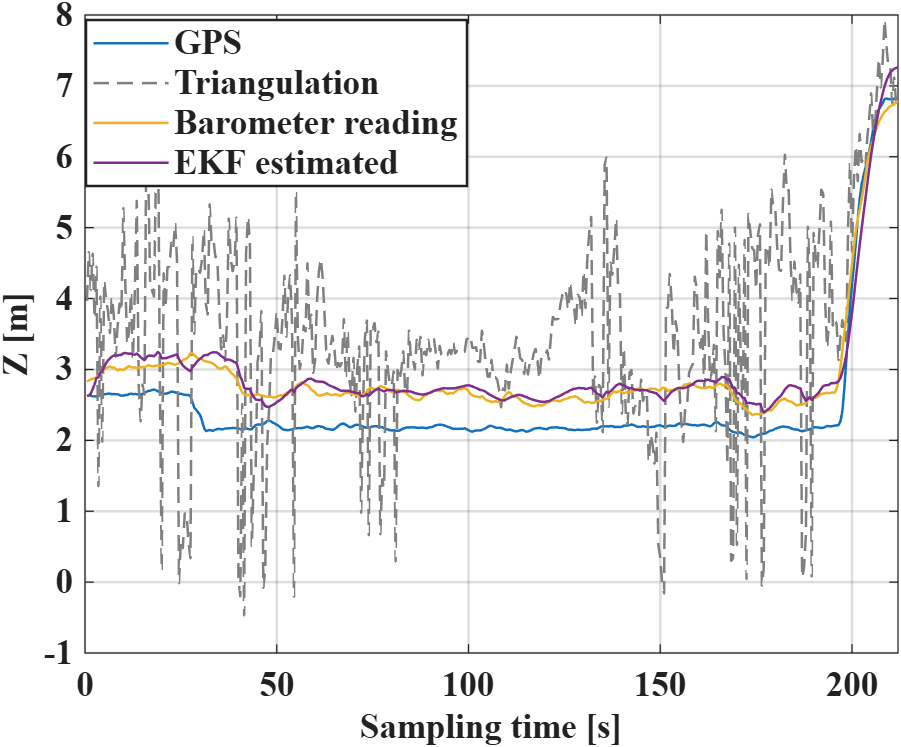
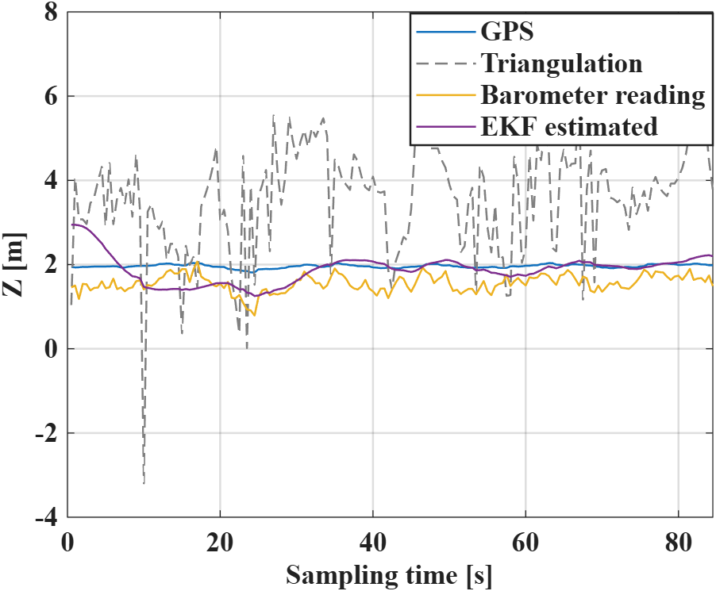
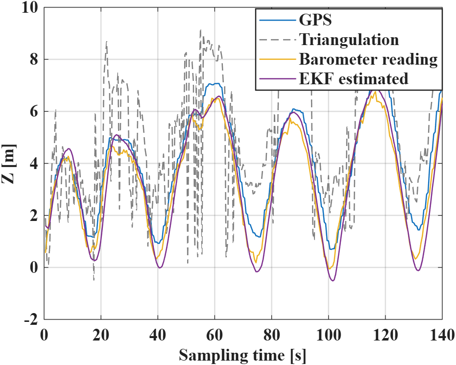

# Performance Evaluation of Measurement-Based GPS-Denied 3D Drone Localization and Tracking

MATLAB code, measurement data, and original result figures supporting:

> M. Meles, A. Rajasekaran, L. Mela, R. Ghazalian, K. Ruttik, and R. Jantti, "Performance evaluation of measurement based GPS denied 3D drone localization and tracking," 2023 IEEE Wireless Communications and Networking Conference (WCNC), 2023.
> DOI: [10.1109/WCNC55385.2023.10118816](https://doi.org/10.1109/WCNC55385.2023.10118816)

The measurement platform uses two synchronized 4-by-4 antenna arrays. The processing chain estimates angle of arrival (AOA) with MUSIC, obtains a 3D position through triangulation, and applies an Extended Kalman Filter (EKF). A barometer measurement is used as a second height update for the relevant trajectories.

## Original MATLAB Results

These images are direct exports of the archived MATLAB `.fig` files. They were not recreated, redrawn, or edited by AI.

| Linear/back-and-forth trajectory | Zigzag trajectory | Up/down trajectory |
|---|---|---|
|  |  |  |

The complete X, Y, Z, azimuth, elevation, range, and error-distribution figures are available in [`results/figures`](results/figures). Their original MATLAB FIG and EPS versions remain in the experiment folders.

## Repository Structure

```text
.
|-- experiments/
|   |-- ZigzaganLinear_3/       # Linear/back-and-forth measurement
|   |-- Zigzagand_2/            # Zigzag measurement
|   `-- UpDown_1 and Zigzag/    # Up/down and zigzag archives
|-- dependencies/               # Shared MATLAB dependencies
|-- results/figures/            # Direct PNG exports from original FIG files
|-- docs/
|   |-- CODE_FLOW.md
|   `-- PRESERVATION.md
|-- paper/README.md              # Publication and manuscript links
`-- CITATION.cff
```

## Main Code

Each experiment archive contains `FinalMeasurement_EKF_P3.m`, which is the main EKF and plotting script. The measurement/AOA/triangulation stage is in `N_Measurement.m`.

The original scripts prompt for the array geometry:

```text
Enter the number of arrays = 2
Enter the spacing between each array = 13
```

These values agree with the paper: two arrays separated by 13 m.

Before running an original script, make the shared dependencies available:

```matlab
addpath(fullfile(pwd, 'dependencies'));
```

Then change to the selected experiment directory and inspect its README and saved workspace before running `FinalMeasurement_EKF_P3.m`. The source is preserved in its original experimental state, including commented switches between trajectories. See [`docs/CODE_FLOW.md`](docs/CODE_FLOW.md) for the exact flow and [`docs/PRESERVATION.md`](docs/PRESERVATION.md) for reproducibility notes.

## Requirements

- MATLAB
- Statistics and Machine Learning Toolbox for `pdf` and `normpdf`
- Sufficient memory for the archived VNA measurement arrays

## Citation

```bibtex
@inproceedings{meles2023performance,
  author    = {Mehari Meles and Akash Rajasekaran and Lauri Mela and Reza Ghazalian and Kalle Ruttik and Riku Jantti},
  title     = {Performance evaluation of measurement based GPS denied 3D drone localization and tracking},
  booktitle = {2023 IEEE Wireless Communications and Networking Conference (WCNC)},
  publisher = {IEEE},
  year      = {2023},
  doi       = {10.1109/WCNC55385.2023.10118816}
}
```

## License

No open-source license has been assigned. Copyright remains with the authors and the respective data and publication rights holders.
